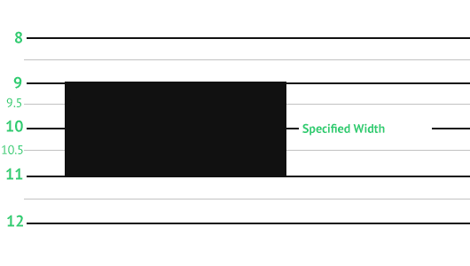
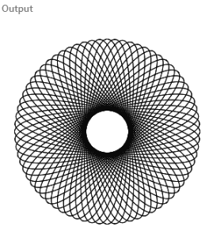

# HTML5 canvas tutorial

Canvas is a **HTML5 element** which renders 2D shapes and bitmap images. The drawing on the canvas is peformed with the JavaScript language.

## Introduction
### HTML5 canvas
HTML5 canvas element provides a resolution-dependent **bitmap area**, which can be used for rendering graphs, game graphics, art, or other visual images on the fly. In simple terms, **canvas is a new element in HTML5, which allows you to draw graphics using JavaScript**. Canvas brings animations to web pages without the need of plugins like Flash, Silverlight, or Java.

HTML5 canvas was originally introduced by Apple in **2004** for use in Mac OS X WebKit to power dashboard applications and their Safari web browser. Since then it has been adopted by Mozilla and Opera. Later, W3C has adopted it in the HTML5 specification. Today, it is supported by all modern web browsers.

### The canvas context
The canvas context is an **object** which exposes the Canvas API to perform the drawings. It provides objects, methods, and properties to draw and manipulate graphics on a canvas drawing surface. The context is retrieved with the `getContext()` method. The argument of the method specifies the desired API: either "`2d`" for two-dimensional graphics, or "`webgl`" for two-dimensional and three-dimensional graphics. It **returns** `null` if the given context Id is not supported.

### Drawing a rectangle
We create a simple example of graphics rendering in HTML5 canvas.
```html
<!--rectangle.html-->
<!DOCTYPE html>
<html><head><title>HTML5 canvas rectangle</title>    
<script>
    function draw() {
        var canvas = document.getElementById('myCanvas');
        var ctx = canvas.getContext('2d');
    
        ctx.fillStyle = "cadetblue";
        ctx.fillRect(0, 0, 100, 100);
    }    
</script>
</head>
<body onload="draw();">
    <canvas id="myCanvas" width="250" height="150"></canvas>
</body></html>
```
The code example draws a cadetblue rectangle in the upper-left corner of a webpage.

- `<!DOCTYPE html>` A document type declaration, or DOCTYPE, is an instruction to the web browser about the nature of the HTML document. This particular declaration tells the browser that the webpage is a HTML5 document. The canvas element was first introduced in HTML5 standard.
- `<script>function draw() {...}</script>` The drawing is performed in the **custom** `draw()` **function**. It is **called** when the body of the HTML document is **loaded**.
- `var canvas = document.getElementById('myCanvas');` With the `getElementById()` **method**, we get the **reference to** the canvas **element**.
- `var ctx = canvas.getContext('2d');` A **rendering context** is **retrieved** with the `getContext()` method.
- `ctx.fillStyle = "cadetblue";` The context's `fillStyle` **property** specifies the colour or style to use inside shapes. The **style is then used in the subsequent drawing operations**.
- `ctx.fillRect(0, 0, 100, 100);` We paint a rectangle in specified colour. The dimensions of the rectangle are given in the method's **parameters**. The first two parameters are x and y coordinates. The next two parameters are the width and height of the rectangle.
- `<body onload="draw();">` The `onload` **property** defines an **event handler** for the load event of a window. The load **event fires** at the end of the document loading process. At this point, all of the objects in the document are in the DOM, and all the images, scripts, links and sub-frames have finished loading. In our case, we **call** the `draw()` method, which performs the drawing on the canvas.
- `<canvas id="myCanvas" width="250" height="150"></canvas>` The canvas **element** is **created** with the `<canvas>` and `</canvas>` tags. The width and height **attributes** set the size of the canvas element within the page. The id attribute identifies the element in the DOM hierarchy.


### Shadow
HTML5 canvas contains properties to create a shadow.
```html
<!--shadow.html-->
<!DOCTYPE html><html><head><title>HTML5 canvas shadow</title>    
<script>
    function draw() {
        var canvas = document.getElementById('myCanvas');
        var ctx = canvas.getContext('2d');

        ctx.shadowOffsetX = 5;
        ctx.shadowOffsetY = 5;
        ctx.shadowBlur    = 4;
        ctx.shadowColor   = "#888";  
        
        ctx.fillStyle = "#000000";
        ctx.fillRect(10, 10, 80, 80);
    }    
</script>
</head>
<body onload="draw();">
    <canvas id="myCanvas" width="250" height="150"></canvas>
</body></html>
```
In the example, we create a shadow beneath a rectangle.
- `ctx.shadowOffsetX = 5;` The `shadowOffsetX` property specifies the distance that the shadow will be offset in the horizontal direction.
- `ctx.shadowOffsetY = 5;` The `shadowOffsetY` property specifies the distance that the shadow will be offset in the vertical direction.
- `ctx.shadowBlur    = 4;` The `shadowBlur` property specifies the level of the blurring effect.
- `ctx.shadowColor   = "#888";` The `shadowColor` property specifies the colour of the shadow.


## Lines
A line is a **simple graphics primitive**. A line is an object which connects two points.

In HTML5 canvas, a line is created with a **path object**. A path is a list of points, connected by segments of lines that can be of different shapes, curved or not, of different width and of different colour. Within a path object, a line is created with the `lineTo()` method.

The following example draws two lines.
```html
<!--lines.html-->
<!DOCTYPE html><html><head><title>HTML5 canvas lines</title>
<script>
    function draw() {
        var canvas = document.getElementById('myCanvas');
        var ctx = canvas.getContext('2d');

        ctx.beginPath();
        ctx.moveTo(20, 20);
        ctx.lineTo(250, 150);
        ctx.stroke();
        
        ctx.beginPath();
        ctx.moveTo(20, 20);
        ctx.lineTo(250, 250);
        ctx.lineWidth = 5;
        ctx.stroke();
    }
</script>
</head>
<body onload="draw();">
    <canvas id="myCanvas" width="350" height="350"></canvas>
</body>
</html> 
```
Two lines are drawn. The second line is thicker.
- `ctx.beginPath();` The `beginPath()` method creates a new path. Once created, subsequent drawing commands are directed into the path and used to build the path.
- `ctx.moveTo(20, 20);` The `moveTo()` method moves the pen to the coordinates specified by x and y.
- `ctx.lineTo(250, 150);` The `lineTo()` method draws a line from the current drawing position to the position specified by x and y.
- `ctx.stroke();` The `stroke()` method **draws the line by stroking its outline**.
- `ctx.lineWidth = 5;` The `lineWidth` sets the width of the second line; the line is thicker.


### Crisp lines
L**ines with odd widths appear to be blurred**. This is because the lines are rendered in between the grid lines of a canvas. There is a quick solution for this—shifting the coordinates by a half unit.
```html
<!--crisp_lines.html-->
<!DOCTYPE html><html><head><title>HTML5 canvas crisp lines</title>
<script>
    function draw() {
        var canvas = document.getElementById('myCanvas');
        var ctx = canvas.getContext('2d');
        
        ctx.lineWidth = 1
        ctx.beginPath();
        ctx.moveTo(20, 20);
        ctx.lineTo(250, 20);
        ctx.stroke();
        
        ctx.lineWidth = 2
        ctx.beginPath();
        //ctx.moveTo(20, 40);
        //ctx.lineTo(250, 40);
        ctx.moveTo(250, 20);
        ctx.lineTo(320, 20);
        ctx.stroke();
        
        ctx.translate(0.5, 0.5);
        
        ctx.lineWidth = 1
        ctx.beginPath();
        ctx.moveTo(20, 60);
        ctx.lineTo(250, 60);
        ctx.stroke();   
        
        ctx.lineWidth = 2
        ctx.beginPath();
        ctx.moveTo(20, 80);
        ctx.lineTo(250, 80);
        ctx.stroke();  
                
        // Reset current transformation matrix to the identity matrix
        ctx.setTransform(1, 0, 0, 1, 0, 0);
    }        
</script>
</head>
<body onload="draw();">
    <canvas id="myCanvas" width="350" height="350"></canvas>
</body>
</html>
```
The example draws four lines. The first two are slightly blurred, the other two are more smooth.
- `ctx.lineWidth = 1` We have a line with an odd width.
- `ctx.translate(0.5, 0.5);` This is a quick fix for the blurriness of the lines. The `translate()` method moves the coordinate system by a half unit.  
https://developer.mozilla.org/en-US/docs/Web/API/CanvasRenderingContext2D/translate


That's why:




Solutions:
1. Draw line, but move axis:
```js
ctx.lineWidth = 1+i;
ctx.beginPath();
ctx.moveTo(5.5,5);
ctx.lineTo(5.5,140);
ctx.stroke();
```
2. Draw rectangle:
```js
ctx.fillRect(5, 5, 1, 140); 
```

### Line dashes
Lines can be drawn using various dashes. A dash is a pattern which is created by **mixing opaque and transparent sections**. A dash is specified with the `setLineDash()` method of the canvas context.
```html
<!--line_dashes.html-->
<!DOCTYPE html><html><head><title>HTML5 canvas line dashes</title>
<script>
    function draw() {
        var canvas = document.getElementById('myCanvas');
        var ctx = canvas.getContext('2d');
        
        ctx.translate(0.5, 0.5);

        ctx.beginPath();
        ctx.setLineDash([2]);
        ctx.moveTo(10, 10);
        ctx.lineTo(250, 10);
        ctx.stroke();
        
        ctx.beginPath();
        ctx.setLineDash([7, 2]);
        ctx.moveTo(10, 20);
        ctx.lineTo(250, 20);
        ctx.stroke();        
        
        ctx.beginPath();
        ctx.setLineDash([4, 4, 1]);
        ctx.moveTo(10, 30);
        ctx.lineTo(250, 30);
        ctx.stroke();
    }            
</script>
</head>
<body onload="draw();">
    <canvas id="myCanvas" width="350" height="250"></canvas>
</body>
</html> 
```
The example draws three lines with different dash patterns.
- `ctx.setLineDash([2]);` This line will alternate opaque and transparent sections of 2 coordinate units.
- `ctx.setLineDash([4, 4, 1]);` Here, the dash consists of the following pattern: 4 units drawn, 4 units not drawn, 1 unit drawn. If the number of elements in the array is odd, the elements of the array get copied and concatenated. For example, `[5, 15, 25]` will become `[5, 15, 25, 5, 15, 25]`


### Caps
Caps are decorations applied to the **ends of unclosed subpaths and dash segments**. There are three different end caps in 2D: `square`, `round`, and `butt`.
- `butt` — ends unclosed subpaths and dash segments with no added decoration.
- `round` — ends unclosed subpaths and dash segments with a round decoration that has a radius equal to half of the width of the pen.
- `square` — ends unclosed subpaths and dash segments with a square projection that extends beyond the end of the segment to a distance equal to half of the line width.
```html
<!--line_caps.html-->
<!DOCTYPE html><html><head><title>HTML5 canvas line caps</title>
<script>
    function draw() {
        var canvas = document.getElementById('myCanvas');
        var ctx = canvas.getContext('2d');
        
        ctx.translate(0.5, 0.5);
        ctx.lineWidth = 8;
        
        ctx.beginPath();
        ctx.lineCap = 'square';
        ctx.moveTo(10, 10);
        ctx.lineTo(250, 10);
        ctx.stroke();
        
        ctx.beginPath();
        ctx.lineCap = 'round';
        ctx.moveTo(10, 30);
        ctx.lineTo(250, 30);
        ctx.stroke();        
        
        ctx.beginPath();
        ctx.lineCap = 'butt';
        ctx.moveTo(10, 50);
        ctx.lineTo(250, 50);
        ctx.stroke();
        
        ctx.lineWidth = 1;
        ctx.beginPath();
        ctx.moveTo(10, 0);
        ctx.lineTo(10, 60);
        ctx.stroke();
        
        ctx.beginPath();
        ctx.moveTo(250, 0);
        ctx.lineTo(250, 60);
        ctx.stroke();
        
        ctx.beginPath();
        ctx.moveTo(254, 0);
        ctx.lineTo(254, 60);
        ctx.stroke();
    }
</script>
</head>
<body onload="draw();">
    <canvas id="myCanvas" width="350" height="250"></canvas>
</body>
</html>
```
In our example, we show all three types of end caps.
- `ctx.lineWidth = 8;`
We increase the width of the lines in order to see the caps better.
- `ctx.lineCap = 'square';` The line cap is specified with the `lineCap` context attribute.

The vertical lines emphasize the difference in size of the lines.


### Joins
Line joins are decorations applied at the **intersection of two path segments and at the intersection of the endpoints of a subpath**. There are three decorations: 'bevel', 'miter', and 'round'.
- `bevel` — joins path segments by connecting the outer corners of their wide outlines with a straight segment.
- `miter` — joins path segments by extending their outside edges until they meet.
- `round` — joins path segments by rounding off the corner at a radius of half the line width.
```html
<!--line_joins.html-->
<!DOCTYPE html><html><head><title>HTML5 canvas line joins</title>
<script>
    function draw() {
        var canvas = document.getElementById('myCanvas');
        var ctx = canvas.getContext('2d');
        
        ctx.translate(0.5, 0.5);   
        ctx.lineWidth = 8;

        ctx.lineJoin = 'miter';
        ctx.strokeRect(10, 10, 100, 100);

        ctx.lineJoin = 'bevel';
        ctx.strokeRect(130, 10, 100, 100);

        ctx.lineJoin = 'round';
        ctx.strokeRect(260, 10, 100, 100);
    }
</script>
</head>
<body onload="draw();">
    <canvas id="myCanvas" width="450" height="350"></canvas>
</body>
</html> 
```
This code example show three different line joins in action.
- `ctx.lineWidth = 8;` With thin lines, it is difficult to tell the differences between the types of joins. For this reason, we make the lines thicker by setting the lineWidth to eight units.
- `ctx.lineJoin = 'miter';` The line join is set with the `lineJoin` attribute.


### Bézier curves
Bézier curves are curved lines (splines) **defined by mathematical formulas**. The mathematical method for drawing curves was created by Pierre Bézier in the late 1960's for the manufacturing of automobiles at Renault.

The `bezierCurveTo()` method of the canvas context adds a cubic Bézier curve to the path. It **requires three points**: the first two points are control points and the third one is the end point. The starting point is the last point in the current path, which can be changed using `moveTo()` before creating the Bézier curve. The shape is modified by moving the control points.
```html
<!--bezier_curve.html-->
<!DOCTYPE html><html><head><title>HTML5 canvas Bézier curve</title>
<meta charset="utf-8">
<script>
    function draw() {
        
        var canvas = document.getElementById('myCanvas');
        var ctx = canvas.getContext('2d');

        ctx.beginPath();
        ctx.moveTo(20, 60);
        ctx.bezierCurveTo(80, 20, 180, 160, 250, 50);
        ctx.stroke();
        
        ctx.fillStyle = 'cadetblue';
        ctx.fillRect(80, 20, 4, 4);
        ctx.fillRect(180, 160, 4, 4);
    }
</script>
</head>
<body onload="draw();">
    <canvas id="myCanvas" width="350" height="350"></canvas>
</body></html>
```
The example draws one Bézier curve.
- `ctx.moveTo(20, 60);` With the moveTo() method, we define the start point of the curve.
- `ctx.bezierCurveTo(80, 20, 180, 160, 250, 50);` With the `bezierCurveTo()` method, we add a Bézier curve to the path. The first two points are the control points; the last point is the ending point of the curve.
- `ctx.fillStyle = 'cadetblue'; ctx.fillRect(80, 20, 4, 4); ctx.fillRect(180, 160, 4, 4);` These lines paint the control points of the curve.


## Shapes
### Rectangles
The first program draws two rectangles.
```html
<!--rectangles.html-->
<!DOCTYPE html><html><head><title>HTML5 canvas rectangles</title>
<script>
    function draw() {
        var canvas = document.getElementById('myCanvas');
        var ctx = canvas.getContext('2d');

        ctx.fillStyle = 'gray';
        ctx.fillRect(10, 10, 60, 60);
        ctx.fillRect(100, 10, 100, 60);
    }
</script>
</head>
<body onload="draw();">
    <canvas id="myCanvas" width="350" height="250"></canvas>
</body></html> 
```
The example uses the `drawRect()` method to paint rectangles.
- `ctx.fillStyle = 'gray';` The interiors of the rectangles are painted in gray colour.
- `ctx.fillRect(10, 10, 60, 60); ctx.fillRect(100, 10, 100, 60);` The `fillRect()` method is used to draw both a square and a rectangle. The first two parameters are x and y coordinates of a shape to be drawn. The last two parameters are the width and the height of the shape.


### Basic shapes (rectangle, circle, triangle, oval, semicircle)
In the following program, we draw some basic shapes.
```html
<!--shapes.html-->
<!DOCTYPE html>
<html>
<head>
<title>HTML5 canvas shapes</title>
<script>
    function draw() {
        
        var canvas = document.getElementById('myCanvas');
        var ctx = canvas.getContext('2d');

        ctx.fillStyle = 'gray';
        ctx.fillRect(10, 10, 60, 60);
        ctx.fillRect(100, 10, 90, 60);
        
        ctx.beginPath();
        ctx.arc(250, 40, 32, 0, 2*Math.PI);
        ctx.fill(); 
        
        ctx.beginPath();
        ctx.moveTo(10, 160);
        ctx.lineTo(90, 160);
        ctx.lineTo(50, 110);
        ctx.closePath();
        ctx.fill();         
        
        ctx.save();
        ctx.scale(2, 1);
        ctx.beginPath();
        ctx.arc(72, 130, 25, 0, 2*Math.PI);
        ctx.fill();
        ctx.restore();
        
        ctx.beginPath();
        ctx.arc(250, 120, 40, 0, Math.PI);
        ctx.fill();                 
    }
</script>
</head>
<body onload="draw();">
<canvas id="myCanvas" width="350" height="350"></canvas>
</body></html>
```
Six different shapes are drawn on the canvas.
- `ctx.fillStyle = 'gray';` The shapes will be painted in gray colour.
- `ctx.fillRect(10, 10, 60, 60); ctx.fillRect(100, 10, 90, 60);` The rectangles are drawn with the `fillRect()` method. **A rectangle is the only shape not initiated by the `beginPath()` method**.
- `ctx.beginPath(); ctx.arc(250, 40, 32, 0, 2*Math.PI); ctx.fill(); ` A **circle** is drawn with the `arc()` method. The method adds an arc to the created path. The first two parameters define the x and y coordinates of the point around which the arc is centered. The next two parameters specify the start and the end angle of the arc. The angles are defined in radians. The last parameter is optional; it specifies the direction in which the arc is drawn. The default direction is clockwise.
- `ctx.beginPath(); ctx.moveTo(10, 160); ctx.lineTo(90, 160); ctx.lineTo(50, 110); ctx.closePath(); ctx.fill();` With the `moveTo()` and `lineTo()` methods, we draw a **triangle**. The `closePath()` method causes the pen to move back to the start of the current sub-path. In our case, it finishes the triangle shape.
- `ctx.save(); ctx.scale(2, 1); ctx.beginPath(); ctx.arc(72, 130, 25, 0, 2*Math.PI); ctx.fill(); ctx.restore();` An **oval** shape is drawn by scaling a circle. The operations are placed between the `save()` and `restore()` methods so that the scale operation does not affect the subsequent drawings.
- `ctx.beginPath(); ctx.arc(250, 120, 40, 0, Math.PI); ctx.fill();` The last shape, a **semicircle**, is drawn with the `arc()` method.


### Pie chart
A pie chart is a circular chart, which is divided into slices to illustrate numerical proportion.
```html
<!--piechart.html-->
<!DOCTYPE html><html><head><title>HTML5 canvas pie chart</title>
<style>
    canvas {background: #bbb}
</style>
<script>
    function draw() {
        var canvas = document.getElementById('myCanvas');
        var ctx = canvas.getContext('2d');

        var beginAngle = 0;
        var endAngle = 0;
        var data = [170, 60, 45]; 
        var total = 0; 
        var colours = ["#95B524", "#AFCC4C", "#C1DD54"];
        const SPACE = 10;
        
        for (var i = 0; i < data.length; i++) {
          total += data[i];
        }

        ctx.strokeStyle = 'white';
        ctx.lineWidth = 2;
        
        for (var j = 0; j < data.length; j++) {
            
            endAngle = beginAngle + (Math.PI * 2 * (data[j] / total));
            ctx.fillStyle = colours[j];
            ctx.beginPath();
            ctx.moveTo(canvas.width/2, canvas.height/2);
            ctx.arc(canvas.width/2, canvas.height/2, canvas.height/2 - SPACE, 
                beginAngle, endAngle, false);
            ctx.closePath();
            ctx.fill();
            ctx.stroke();
            beginAngle = endAngle;
        }               
    }
</script>
</head>
<body onload="draw();">
    <canvas id="myCanvas" width="350" height="300"></canvas>
</body></html>
```
The example draws a pie chart. It has three slices, painted in different shades of a green colour.
- `<style>canvas {background: #bbb}</style>` In order for the white outlines of the chart to be clearly visible, we change the background colour of the canvas to gray colour.
- `var data = [170, 60, 45];` This is the data that the pie chart illustrates.
- `const SPACE = 10;` The SPACE constant is a distance from the pie chart to the borders of the canvas.
- `endAngle = beginAngle + (Math.PI * 2 * (data[j] / total));` The formula calculates the end angle of the currently painted slice.
- `ctx.moveTo(canvas.width/2, canvas.height/2); ctx.arc(canvas.width/2, canvas.height/2, canvas.height/2 - SPACE, beginAngle, endAngle, false); ctx.closePath();` Three methods are used to paint the current slice: moveTo(), arc(), and closePath().
- `ctx.fill(); ctx.stroke();` We draw both the insides and outlines of the shapes.
- `beginAngle = endAngle;` For the next slice, the last ending angle becomes the beginning angle.


### Star
The following example creates a star shape.
```html
<!--star.html-->
<!DOCTYPE html>
<html>
<head>
<title>HTML5 canvas star shape</title>
<script>
    function draw() {
        var canvas = document.getElementById('myCanvas');
        var ctx = canvas.getContext('2d');

        ctx.fillStyle = 'gray';

        var points = [ [ 0, 85 ], [ 75, 75 ], [ 100, 10 ], [ 125, 75 ], 
            [ 200, 85 ], [ 150, 125 ], [ 160, 190 ], [ 100, 150 ], 
            [ 40, 190 ], [ 50, 125 ], [ 0, 85 ] ];
        
        var len = points.length;

        ctx.beginPath();
        ctx.moveTo(points[0][0], points[0][1]);
        
        for (var i = 0; i < len; i++) {
            ctx.lineTo(points[i][0], points[i][1]);
        }        
        
        ctx.fill(); 

    }
</script>
</head>
<body onload="draw();">
    <canvas id="myCanvas" width="350" height="250"></canvas>
</body></html> 
```
A star shape is created from a series of points.
- `var points = [ [ 0, 85 ], [ 75, 75 ], [ 100, 10 ], [ 125, 75 ], [ 200, 85 ], [ 150, 125 ], [ 160, 190 ], [ 100, 150 ], [ 40, 190 ], [ 50, 125 ], [ 0, 85 ] ];` These are the coordinates of the star.
- `ctx.moveTo(points[0][0], points[0][1]);` We move to the initial coordinate of the shape with the `moveTo()` method.
- `for (var i = 0; i < len; i++) {ctx.lineTo(points[i][0], points[i][1]);}` Here we connect all the coordinates of the star using the `lineTo()` method.
- `ctx.fill();` The `fill()` method fills the interior of the star shape with the defined (gray) colour.


### Three circles
It is possible to create new shapes with **compositing**. Compositing is a rule that determines the way the shapes in a canvas blend.
```html
<!--three_circles.html-->
<!DOCTYPE html><html><head><title>HTML5 Canvas three circles</title>
<script>
    function draw() {
        var canvas = document.getElementById('myCanvas');
        var ctx = canvas.getContext('2d');
        
        ctx.lineWidth = 3;
        
        ctx.fillStyle = 'gray';
        ctx.beginPath();
        ctx.arc(90, 90, 60, 0, 2*Math.PI);
        ctx.stroke();
                
        ctx.beginPath();
        ctx.arc(120, 150, 60, 0, 2*Math.PI);
        ctx.stroke();

        ctx.beginPath();
        ctx.arc(150, 100, 60, 0, 2*Math.PI);
        ctx.stroke();        

        ctx.globalCompositeOperation='destination-out';

        ctx.beginPath();
        ctx.arc(90, 90, 60, 0, 2*Math.PI);
        ctx.fill();
                
        ctx.beginPath();
        ctx.arc(120, 150, 60, 0, 2*Math.PI);
        ctx.fill();

        ctx.beginPath();
        ctx.arc(150, 100, 60, 0, 2*Math.PI);
        ctx.fill();
    }
</script>
</head>
<body onload="draw();">
    <canvas id="myCanvas" width="400" height="350"></canvas>
</body></html>
```
The example creates a shape by combining the outlines of three circles. The three circles overlap.
- `ctx.beginPath();ctx.arc(90, 90, 60, 0, 2*Math.PI); ctx.stroke();` A circle is drawn on the canvas.
- `ctx.globalCompositeOperation='destination-out';` The compositing operation is set to `destination-out`. In this mode, the destination is displayed everywhere the source and destination do not overlap. Everywhere else, transparency is displayed.
- `ctx.beginPath(); ctx.arc(90, 90, 60, 0, 2*Math.PI); ctx.fill();` Now the same circles are filled with gray colour. New drawings will erase existing drawings where the two overlap. As a consequence, only the outlines remain.


## Fills
Fills are used to paint the interiors of shapes. There are **three basic fills: colours, gradients, and patterns**. To set the style of the shape's inside, we use the `fillStyle` property.

### Colours
A common system of **representing colours in computers is RGB**; colours are represented as **combinations of red, green, and blue intensity values**.
```html
<!--colours.html-->
<!DOCTYPE html><html><head><title>HTML5 Canvas colour fills</title>
<script>
    function draw() {
        var canvas = document.getElementById('myCanvas');
        var ctx = canvas.getContext('2d');

        ctx.fillStyle = 'brown';
        ctx.fillRect(10, 10, 90, 60);
        
        ctx.fillStyle = 'rgb(217, 146, 54)';
        ctx.fillRect(130, 10, 90, 60);
        
        ctx.fillStyle = '#3F79BA';
        ctx.fillRect(250, 10, 90, 60);        
    }
</script>
</head>
<body onload="draw();">
    <canvas id="myCanvas" width="350" height="250"></canvas>
</body></html>
``` 
In the example we draw three coloured rectangles. The colours are specified in three different formats.
- `ctx.fillStyle = 'brown';` In this line a string value is used to set the colour value.
- `ctx.fillStyle = 'rgb(217, 146, 54)';` Here we use the RGB system.
- `ctx.fillStyle = '#3F79BA';` The colour of the third rectangle is set with the hexadecimal notation of the RGB system.


### Linear gradient
In computer graphics, **gradient is a smooth blending of shades from light to dark or from one colour to another**. In 2D drawing programs and paint programs, gradients are used to create colorful backgrounds and special effects as well as to **simulate lights and shadows**.

There are **two types of gradients: linear and radial**. The first example demonstrates the linear gradient in HTML5 canvas.
```html
<!--linear_gradient.html-->
<!DOCTYPE html>
<html>
<head>    
<title>HTML5 canvas linear gradient</title>
<script>
    function draw() {
        var canvas = document.getElementById('myCanvas');
        var ctx = canvas.getContext('2d');
        
        var lgr = ctx.createLinearGradient(150, 0, 150, 160);
        lgr.addColorStop(0.2, "black");
        lgr.addColorStop(0.5, "red");
        lgr.addColorStop(0.8, "black");
    
        ctx.fillStyle = lgr;
        ctx.fillRect(0, 0, 300, 160);
    }
</script>
</head>
<body onload="draw();">
    <canvas id="myCanvas" width="350" height="350"></canvas>
</body></html>
```
The code example fills a rectangle with a linear gradient. A linear gradient is a gradient created along a line.
- `var lgr = ctx.createLinearGradient(150, 0, 150, 160);` The `createLinearGradient()` method creates a gradient along the line given by the coordinates represented by the parameters. The parameters are x and y coordinates of the start and end points.
- `lgr.addColorStop(0.2, "black"); lgr.addColorStop(0.5, "red"); lgr.addColorStop(0.8, "black");` The `addColorStop()` method defines new stops on the gradient with specified offsets and colours. In our case, the colour stops set where the black and red colour start and end.
- `ctx.fillStyle = lgr;` The created linear gradient is set to be the current `fillStyle`.
- `ctx.fillRect(0, 0, 300, 160);` With the `fillRect()` method a rectangle is painted. The interior of the rectangle is filled with our linear gradient.


### Radial gradient
Radial gradients are blendings of colours or shades of colours between two circles.
```html
<!--radial_gradient.html-->
<!DOCTYPE html><html><head><title>HTML5 canvas radial gradient</title>
<script>
    function draw() {
        var canvas = document.getElementById('myCanvas');
        var ctx = canvas.getContext('2d');
    
        var rgr = ctx.createRadialGradient(canvas.width/2, canvas.height/2, 5, 
            canvas.width/2, canvas.height/2, 100);
        rgr.addColorStop(0, "black");
        rgr.addColorStop(0.3, "yellow");
        rgr.addColorStop(1, "black");
    
        ctx.fillStyle = rgr;
        ctx.fillRect(0, 0, 250, 250);
    }
</script>
</head>
<body onload="draw();">
<canvas id="myCanvas" width="250" height="250"></canvas>
</body></html>
```
The code example fills a rectangle with a radial gradient.
- `var rgr = ctx.createRadialGradient(canvas.width/2, canvas.height/2, 5, canvas.width/2, canvas.height/2, 100);`The `createRadialGradient()` method creates a radial gradient given by the coordinates of the two circles represented by the parameters. We set the circles into the middle of the canvas. The first two parameters set the x and y coordinates of the start circle. The third parameter is the radius of the start circle. The next two parameters are the x and y coordinates of the end circle. The last parameter specifies the radius of the end cirle.
- `rgr.addColorStop(0, "black"); rgr.addColorStop(0.3, "yellow"); rgr.addColorStop(1, "black");` The `addColorStop()` method sets the alternating colours in the radial gradient: black and yellow.
- `ctx.fillStyle = rgr; ctx.fillRect(0, 0, 250, 250);` A rectangle is drawn with the radial gradient fill.


### Pattern
A patter is an image applied to a shape. It is also called an **image texture**.
```html
<!--pattern.html-->
<!DOCTYPE html><html><head><title>HTML5 canvas pattern</title>
<script>
    function draw() {
        var canvas = document.getElementById('myCanvas');
        var ctx = canvas.getContext('2d');

        var img = new Image();
        img.src = 'crack.png';
        
        img.onload = function() {
            var pattern = ctx.createPattern(img, 'repeat');

            ctx.rect(0, 0, canvas.width, canvas.height);
            ctx.fillStyle = pattern;
            ctx.fill();
      };
    }
</script>
</head>
<body onload="draw();">
    <canvas id="myCanvas" width="250" height="250"></canvas>
</body></html>
```
The example fills the whole canvas with a repeating image texture.
- `var img = new Image();` The `Image()` is a HTML5 constructor for the HTML image element.
- `img.src = 'crack.png';` In the `src` attribute, we set the URL of the image.
- `var pattern = ctx.createPattern(img, 'repeat');` The `createPattern()` method creates a pattern using the specified image. It repeats the source in the directions specified by the repetition argument. The '`repeat`' value repeats the pattern in both directions.


## Transparency
### Transparency explained
Transparency is the **quality of being able to see through a material**. The easiest way to understand transparency is to imagine a piece of glass or water. Technically, the rays of light can go through the glass and this way we can see objects behind the glass.

In computer graphics, we can achieve transparency effects using **alpha compositing**. Alpha compositing is the process of combining an image with a background to create the appearance of partial transparency. The composition process uses an **alpha channel**. Alpha channel is an 8-bit layer in a graphics file format that is used for expressing **translucency (transparency)**. The extra eight bits per pixel serves as a mask and represents 256 levels of translucency.

### Transparent rectangles
The next example draws ten rectangles with different levels of transparency.
```html
<!--transparent_rectangles.html-->
<!DOCTYPE html><html><head><title>HTML5 canvas transparent rectangles</title>
<script>
    function draw() {
        var canvas = document.getElementById('myCanvas');
        var ctx = canvas.getContext('2d');
        
        ctx.fillStyle = "blue";
        
        for (var i = 1; i <= 10; i++) {
            var alpha = i * 0.1;
            ctx.globalAlpha = alpha;       
            ctx.fillRect(50*i, 20, 40, 40);
        }          
    }
</script>    
</head>    
<body onload="draw();">
    <canvas id="myCanvas" width="550" height="200"></canvas>
</body></html> 
```
We draw ten blue rectangles with various levels of transparency applied.
- `ctx.fillStyle = "blue";` The rectangles will be filled with blue colour.
- `var alpha = i * 0.1;` The alpha value dynamically changes in the for loop. In each loop, it is decreased by 10%.
- `ctx.globalAlpha = alpha;` The `globalAlpha` property specifies the alpha value that is applied to shapes and images before they are drawn onto the canvas. The value is in the range from `0.0` (fully **transparent**) to `1.0` (fully **opaque**).
- `ctx.fillRect(50*i, 20, 40, 40);` The `fillRect()` method draws a filled rectangle. Its parameters are x and y coordinates and width and height of the rectangle.


### Fade out demo
In the next example, we will fade out an image. The image will gradually get more transparent until it is completely invisible.
```html
<!--fadeout.html-->
<!DOCTYPE html><html><head><title>HTML5 canvas fade out demo</title>
<script>
    var alpha = 1.0;
    var ctx;
    var canvas;
    var img;

    function init() {
        canvas = document.getElementById('myCanvas');
        ctx = canvas.getContext('2d');
        
        img = new Image();
        img.src = 'mushrooms.jpg';
        
        img.onload = function() {
            ctx.drawImage(img, 10, 10);
        };
      
        fadeOut();
    }
    
    function fadeOut() {
        
        if (alpha <= 0) {
            return;
        }         
            
        requestAnimationFrame(fadeOut);
        ctx.clearRect(0,0, canvas.width, canvas.height);
        ctx.globalAlpha = alpha;
            
        ctx.drawImage(img, 10, 10);
 
        alpha += -0.01;
    }        
</script>    
</head>    
<body onload="init();">
    <canvas id="myCanvas" width="350" height="250"></canvas>
</body></html>
```
The example is animated. In each animation cycle, the alpha value decreases and the image is redrawn.
- `img = new Image(); img.src = 'mushrooms.jpg'; img.onload = function() {ctx.drawImage(img, 10, 10);}` These lines load and display an image on the canvas.
- `fadeOut();` Inside the `init()` function, we call the `fadeOut()` function, which starts the animation.
- `if (alpha <= 0) {return;}` When the `alpha` value reaches zero, the animation is terminated. The `fadeOut()` function is not called anymore by the `requestAnimationFrame()` function.
- `requestAnimationFrame(fadeOut);` The `requestAnimationFrame()` is a **convenient function to create animations**. It tells the browser to perform an animation. The parameter is a function to be invoked before the repaint. The browser chooses an optimal frame rate for the animation.
- `ctx.clearRect(0,0, canvas.width, canvas.height);` The `clearRect()` method erases the canvas.
- `ctx.globalAlpha = alpha; ctx.drawImage(img, 10, 10);` A new global alpha value is set and the image is redraw, taking the new alpha value into consideration.
- `alpha += -0.01;` Finally, the alpha is decreased. In the next animation cycle the image is drawn with a decreased `alpha` value.


## Compositing
**Compositing is the combining of visual elements from separate sources into single images**. They are used to create the illusion that all those elements are parts of the same scene. Compositing is widely used in film industry to create crowds, entire new worlds which would be expensive or impossible to create otherwise.

The _Three circles example_ in the [Shapes]() chapter of this tutorial uses a `destination-out` compositing operation to create a new shape.

### Compositing operations
The https://developer.mozilla.org lists in its [Compositing and clipping](https://developer.mozilla.org/en-US/docs/Web/API/Canvas_API/Tutorial/Compositing) chapter **twenty six various compositing operations**. We show some of them in the next code example.

Say we want to draw two objects on a canvas. The **first object drawn is called a destination, the second one a source**. The `globalCompositeOperation` property of the canvas context determines how these two objects are going to be blended together. For example in the `source-over` rule, which is the **default compositiong operation**, new shapes are draw on top of the existing shapes.

```html
<!--compositing.html-->
<!DOCTYPE html><html><head><title>HTML5 Canvas compositing operations</title>  
<style>
    canvas {border: 1px solid brown}
    select {vertical-align:top}
</style>  
<script>
    var canvas;
    var ctx;
    var value = 'source-over';
    var operations = ['source-over', 'source-in', 'source-out', 'source-atop', 'destination-over', 'destination-in', 'destination-out', 'destination-atop', 'lighter', 'copy', 'xor'];
    function init() {
        canvas = document.getElementById('myCanvas');
        ctx = canvas.getContext('2d');
        draw();    
    }

    function getOperation(sel) {
        value = operations[sel.value];
        draw();
    }

    function draw() {
      ctx.save();
      ctx.clearRect(0, 0, canvas.width, canvas.height);
      ctx.fillStyle = 'blue';
      ctx.fillRect(20, 20, 40, 40);
      
      ctx.globalCompositeOperation = value; 
      
      ctx.fillStyle = 'green';
      ctx.fillRect(25, 25, 40, 40);
      ctx.restore();
    }    
</script>
</head>
<body onload="init();">
    <canvas id="myCanvas" width="150" height="100"></canvas>
    <select id="opers" onchange="getOperation(this)">
      <option value="0" selected="selected">source-over</option>
      <option value="1">source-in</option>
      <option value="2">source-out</option>
      <option value="3">source-atop</option>
      <option value="4">destination-over</option>
      <option value="5">destination-in</option>
      <option value="6">destination-out</option>
      <option value="7">destination-atop</option>
      <option value="8">lighter</option>
      <option value="9">copy</option>
      <option value="10">xor</option>
    </select>   
</body></html>
```
In the example, we have have a drop-down list of compositing operations. The chosen operation is applied on the drawing of two overlapping rectangles.
- `var operations = ['source-over', 'source-in', 'source-out', 'source-atop', 'destination-over', 'destination-in', 'destination-out','destination-atop', 'lighter', 'copy', 'xor'];` The operations array holds eleven compositing operations.
- `function init() { canvas = document.getElementById('myCanvas'); ctx = canvas.getContext('2d'); draw();}` Inside the `init()` function, we get the reference to the canvas object and its drawing context.
- `ctx.save();...ctx.restore();` Each time we select an option from the drop-down list, the `canvas` is redrawn with a new composition operation in action. In order to get correct results, we must place the drawing code between `save()` and `restore()` methods. This way the operations are isolated from each other.
- `ctx.clearRect(0, 0, canvas.width, canvas.height);` The `clearRect()` method clears the previous output.
- `ctx.globalCompositeOperation = value;` The `globalCompositeOperation` is set with the chosen value from the drop-down list.


The above figure shows a `xor` compositing operation. In this rule, shapes are made transparent where both overlap and drawn normal everywhere else.  
[Interactive version](https://reregaga.github.io/conspect-zetcode_com-html5canvas/index.html).  
[Another interactive version](https://www.rgraph.net/canvas/reference/globalcompositeoperation.html)

## Transformations
An **affine transform** is composed of zero or more **linear transformations** (**rotation, scaling, or shear**) and **translation** (**shift**). Several linear transformations can be combined into a single matrix. A rotation is a transformation that moves a rigid body around a fixed point. A scaling is a transformation that enlarges or diminishes objects. The scale factor is the same in all directions. A translation is a transformation that moves every point a constant distance in a specified direction. A shear is a transformation that moves an object perpendicular to a given axis, with greater value on one side of the axis than the other.

There is a `transform()` method, which multiplies the current transformation with the matrix described by the arguments of the method. We are able to scale, rotate, move, and shear the context. There are also methods that perform specific transformations: `translate()`, `rotate()`, and `scale()`.

### Translation
The following example shows a simple translation.
```html
<!--translation.html-->
<!DOCTYPE html><html><head><title>HTML5 canvas translation</title>
<style>canvas {border: 1px solid #bbbbbb}</style>    
<script>
    function draw() {
        var canvas = document.getElementById('myCanvas');
        var ctx = canvas.getContext('2d');
    
        ctx.fillStyle = 'gray';
        ctx.translate(canvas.width/2, canvas.height/2);
        ctx.beginPath();
        ctx.arc(0, 0, 30, 0, 2*Math.PI);
        ctx.fill();
    }    
</script>
</head>
<body onload="draw();">
    <canvas id="myCanvas" width="150" height="150"></canvas>
</body></html>
```
The example draws a circle in the middle of the canvas.
- `ctx.translate(canvas.width/2, canvas.height/2);` The `translate()` method moves the origin of the coordinate system into the middle of the canvas.
- `ctx.beginPath();ctx.arc(0, 0, 30, 0, 2*Math.PI);ctx.fill();` A circle is drawn. Its center point is the middle of the canvas.


### Rotation
The next example demonstrates a rotation.
```html
<!--rotation.html-->
<!DOCTYPE html><html><head><title>HTML5 canvas rotation</title>
<script>
    function draw() {
        var canvas = document.getElementById('myCanvas');
        var ctx = canvas.getContext('2d');
    
        ctx.fillStyle = 'gray';
        ctx.rotate(Math.PI/10);
        ctx.fillRect(50, 10, 120, 80);
    }    
</script>
</head>
<body onload="draw();">
    <canvas id="myCanvas" width="200" height="200"></canvas>
</body></html>
```
The example performs a rotation on a rectangle.
- `ctx.rotate(Math.PI/10);` The `rotate()` method performs rotation. The angle argument represents a clockwise rotation angle and is expressed in radians.


### Scaling
Scaling is done with the `scale()` method. The method takes two parameters: x scale factor and y scale factor.
```html
<!--scaling.html-->
<!DOCTYPE html><html><head><title>HTML5 canvas scaling</title>
<script>
    function draw() {
        var canvas = document.getElementById('myCanvas');
        var ctx = canvas.getContext('2d');
    
        ctx.fillStyle = 'gray';
        ctx.fillRect(20, 20, 80, 50);

        ctx.save();
        ctx.translate(110, 22);
        ctx.scale(0.5, 0.5);
        ctx.fillRect(0, 0, 80, 50);
        ctx.restore();

        ctx.translate(170, 20);
        ctx.scale(1.5, 1.5);
        ctx.fillRect(0, 0, 80, 50);
    }    
</script>
</head>
<body onload="draw();">
    <canvas id="myCanvas" width="300" height="200"></canvas>
</body></html>
```
In the example, there is a rectangle object. First, we scale it down and then we scale it up a bit.
- `ctx.save();ctx.translate(110, 22);ctx.scale(0.5, 0.5);ctx.fillRect(0, 0, 80, 50);ctx.restore();` The transformation operations are additive. In order to isolate the translation and scaling operations, we place them between `save()` and `restore()` methods. The `save()` method saves the entire state of the canvas and the `restore()` method restores it.


### Shearing
A shear is a transformation that distorts the shape of an object along either or both of the axes. Like scale and translate, a shear can be done along just one or along both of the coordinate axes.
```html
<!--shearing.html-->
<!DOCTYPE html><html><head><title>HTML5 canvas shearing</title>
<script>
    function draw() {
        var canvas = document.getElementById('myCanvas');
        var ctx = canvas.getContext('2d');
        
        ctx.translate(0.5, 0.5);
        ctx.setLineDash([2]);
        
        ctx.save();
        ctx.strokeStyle = 'green';
        ctx.strokeRect(50, 90, 160, 50);
        ctx.restore();
        
        ctx.save();
        ctx.strokeStyle = 'blue';
        ctx.transform(1, 1, 0, 1, 0, 0);
        ctx.strokeRect(50, 40, 80, 50);
        ctx.restore();
        
        ctx.save();
        ctx.strokeStyle = 'red';
        ctx.transform(1, 1, 0, 1, 0, -130);
        ctx.strokeRect(130, 10, 80, 50);
        ctx.restore();        
    }    
</script>
</head>
<body onload="draw();">
    <canvas id="myCanvas" width="300" height="300"></canvas>
</body></html>
```
There is not a specifiec method for shearing, we use the generic `transform()` method.
- `ctx.translate(0.5, 0.5);` This line makes the lines of the rectangles smoother.
- `ctx.save();ctx.strokeStyle = 'blue';ctx.transform(1, 1, 0, 1, 0, 0);ctx.strokeRect(50, 40, 80, 50);ctx.restore();` The blue rectangle is horizontally sheared (skewed). The parameters of the `transform()` method are: horizontal scaling, horizontal shearing, vertical shearing, vertical scaling, horizontal translation, and vertical translation.


### Donut
In the following example we create an complex shape by rotating an ellipse.
```html
<!--donut.html-->
<!DOCTYPE html><html><head><title>HTML5 canvas donut</title>
<script>
    function draw() {
        var canvas = document.getElementById('myCanvas');
        var ctx = canvas.getContext('2d');
    
        ctx.fillStyle = 'gray';
        ctx.translate(0.5, 0.5);
        
        var x = canvas.width/2;
        var y = canvas.height/2;

        for (var deg = 0; deg < 360; deg += 5) {
            var rad = deg * Math.PI / 180; 
            ctx.beginPath();
            ctx.ellipse(x, y, 30, 130, rad, 0, 2*Math.PI);
            ctx.stroke();
        }
    }    
</script>
</head>
<body onload="draw();">
    <canvas id="myCanvas" width="300" height="300"></canvas>
</body></html>
```
The example uses the `ellipse()` method, which at the moment of writing this tutorial, is not supported by all browers. The example runs on Chrome and Opera.
- `var x = canvas.width/2;var y = canvas.height/2;` The ellipse's center point is located in the center of the canvas.
- `for (var deg = 0; deg < 360; deg += 5) {var rad = deg * Math.PI / 180; ctx.beginPath(); ctx.ellipse(x, y, 30, 130, rad, 0, 2*Math.PI); ctx.stroke();}` We create 36 ellipses. The ellipses are rotated. The `ellipse()` method takes the following parameters: the x and y coordinates of the ellipse's center point, the ellipse's major axis radius, the ellipse's minor axis radius, rotation, start angle, and end angle.



## Text
### Text and fonts
A **character** is a symbol that represents an item such as a letter, a digit, or a punctuation. A **glyph** is a shape used to render a character or a sequence of characters. In the Latin alphabet a glyph typically represents one character. In other writing systems, a character may be composed of several glyphs, like ť, ž, ú, ô. These are Latin characters with accents.

Text can be drawn on the canvas using various fonts. A **font** is a set of type characters of a particular typeface design and size. Various typefaces include Helvetica, Georgia, Times, or Verdana. A collection of glyphs with a particular style form a **font face**. A collection of font faces forms a **font family**.

### Drawing text
HTML5 canvas context has two methods for drawing text: `strokeText()` and `fillText()`. The difference is that the `fillText()` method draws the inside of the text, while the `strokeText()` method draws the outlines of the text.
```html
<!--drawing_text.html-->
<!DOCTYPE html><html><head><title>HTML5 canvas drawing text</title>
<script>
    function draw() {
        var canvas = document.getElementById('myCanvas');
        var ctx = canvas.getContext('2d');

        ctx.font = "28px serif";
        ctx.fillText("ZetCode", 15, 25);
        
        ctx.font = "36px sans-serif";
        ctx.strokeText("ZetCode", 30, 80);
    }      
</script>
</head>
<body onload="draw();">
    <canvas id="myCanvas" width="200" height="150"></canvas>
</body></html>
```
The example draws two strings on the canvas.
- `ctx.font = "28px serif";` The canvas context font property specifies the current text style being used when drawing text. We specify the font size and font family.
- `ctx.fillText("ZetCode", 15, 25);` The first parameter of the `fillText()` method is the text to be rendered. The next two parameters are the x and y coordinates of the text starting point.


### Font
In the following example, we demonstrate several font properties.
```html
<!--text_font.html-->
<!DOCTYPE html><html><head><title>HTML5 canvas drawing text</title>
<script>
    function draw() {
        var canvas = document.getElementById('myCanvas');
        var ctx = canvas.getContext('2d');

        ctx.font = "normal bold 18px serif";
        ctx.fillText('nice', 10, 20); 
        
        ctx.font = "italic 18px serif";
        ctx.fillText('pretty', 70, 20);
        
        ctx.font = "small-caps bolder 18px serif";
        ctx.fillText('beautiful', 160, 20);  
    }      
</script>
</head>
<body onload="draw();">
    <canvas id="myCanvas" width="350" height="150"></canvas>
</body></html>
```
The example draws three words with different font style, variant, and weight.
- `ctx.font = "normal bold 18px serif";` This line sets a normal font style and bold font weight.
- `ctx.font = "small-caps bolder 18px serif";` This line sets a small-caps font variant and bolder font weight.


### Text baseline
The `textBaseline` property of the canvas 2D API specifies the current text baseline being used when drawing text. It accepts the following values: `top`, `bottom`, `middle`, `alphabetic`, `hanging`, `ideographic`. The **default is `alphabetic`**.
```html
<!--text_baseline.html-->
<!DOCTYPE html><html><head><title>HTML5 canvas text baseline</title>
<style>canvas {border: 1px solid #bbbbbb}</style>    
<script>
    function draw() {
        var canvas = document.getElementById('myCanvas');
        var ctx = canvas.getContext('2d');
    
        ctx.translate(0.5, 0.5);
        ctx.setLineDash([2]);
        
        ctx.fillStyle = 'gray';
        ctx.lineWidth = 1;
        ctx.beginPath();
        ctx.moveTo(0, 100);
        ctx.lineTo(canvas.width, 100);
        ctx.stroke();
    
        ctx.font = '20px serif';
        ctx.textBaseline = "top";
        ctx.fillText('Top', 5, 100); 
        
        ctx.textBaseline = "bottom"; 
        ctx.fillText('Bottom', 60, 100); 
        
        ctx.textBaseline = "middle"; 
        ctx.fillText('Middle', 150, 100); 
        
        ctx.textBaseline = "alphabetic"; 
        ctx.fillText('Alphabetic', 240, 100); 
        
        ctx.textBaseline = "hanging"; 
        ctx.fillText('Hanging', 360, 100); 
        
        ctx.textBaseline = "ideographic";
        ctx.fillText('Ideographic', 460, 100);
    }    
</script>
</head>
<body onload="draw();">
    <canvas id="myCanvas" width="600" height="200"></canvas>
</body></html>
```
The example draws strings using all available text baselines.
- `ctx.textBaseline = "top"; ctx.fillText('Top', 5, 100); ` These lines draw a text on the `top` baseline mode.


### Text alignment
The `textAlign` property of the Canvas 2D API specifies the current text alignment being used when drawing text. The alignment is based on the x value of the `fillText()` method. Possible values are: `left`, `right`, `center`, `start`, and `end`.
```html
<!--text_alignment.html-->
<!DOCTYPE html><html><head><title>HTML5 canvas text alignment</title>
<style>canvas {border: 1px solid #bbbbbb}</style>    
<script>
    function draw() {
        var canvas = document.getElementById('myCanvas');
        var ctx = canvas.getContext('2d');
    
        var cw = canvas.width/2;
    
        ctx.fillStyle = 'gray';
        ctx.translate(0.5, 0.5);
        ctx.setLineDash([2]);
        
        ctx.beginPath();
        ctx.moveTo(cw, 0);
        ctx.lineTo(cw, canvas.height);
        ctx.stroke();
        
        ctx.font = "16px serif";
        
        ctx.textAlign = "center";
        ctx.fillText("center", cw, 20);
        
        ctx.textAlign = "start";
        ctx.fillText("start", cw, 60);
        
        ctx.textAlign = "end";
        ctx.fillText("end", cw, 100);
        
        ctx.textAlign = "left";
        ctx.fillText("left", cw, 140);
        
        ctx.textAlign = "right";
        ctx.fillText("right", cw, 180);
    }    
</script>
</head>
<body onload="draw();">
    <canvas id="myCanvas" width="350" height="200">
    </canvas>
</body></html>
```
The example draws text with all available text alignments applied.
- `var cw = canvas.width/2;` We compute the x coordinate of the middle point of the canvas. Our text is aligned around this point.
- `ctx.beginPath(); ctx.moveTo(cw, 0); ctx.lineTo(cw, canvas.height); ctx.stroke();` For better visual understanding, we draw a thin vertical line in the middle of the canvas.
- `ctx.textAlign = "center"; ctx.fillText("center", cw, 20);` These lines center the text horizontally.


## Animation
**Animation** is a rapid succession of images which make an illusion of movement. Animation is not restricted to movement, however. Changing the background of a object over time is considered an animation too.

There are **three functions to create animation in HTML5 canvas**:
- `setInterval(function, delay)`
- `setTimeut(function, delay)`
- `requestAnimationFrame(callback)`

The `setInterval()` function repeatedly executes the passed function every `delay` milliseconds. The `setTimeout()` executes the specified function in `delay` milliseconds. In order to create animation, the `setTimeout()` is called from within the executed function. The `requestAnimationFrame()` function lets the browser call a specified function to update an animation before the next repaint. The browser does some optimisations.

### Move along curve
In the first animation, an object is moved along a curve.
```html
<!--move_along_curve.html-->
<!DOCTYPE html><html><head><title>HTML5 canvas move along curve</title>
<style>canvas { border: 1px solid #bbbbbb }</style>
<script>
    var canvas,
        ctx,
        x = 20, 
        y = 80;
    const DELAY = 30,
          RADIUS = 10;

    function init() {
        canvas = document.getElementById('myCanvas');
        ctx = canvas.getContext('2d');
        setInterval(move_ball, DELAY);
    }
    function draw() {           
        ctx.clearRect(0, 0, canvas.width, canvas.height);
        ctx.beginPath();
        ctx.fillStyle = "cadetblue";
        ctx.arc(x, y, RADIUS, 0, 2*Math.PI);
        ctx.fill();
    }
    function move_ball() {   
        x += 1;
        if (x > canvas.width + RADIUS) { x = 0; }
        y = Math.sin(x/32)*30 + 80;
        draw();
    } 
</script></head>
<body onload="init();"><canvas id="myCanvas" width="350" height="150"></canvas></body></html>
```
The example moves a circle along a sine curve. After the circle moves past the end of the canvas, it reappears on the left side.
- `setInterval(move_ball, DELAY);` The `setInterval()` function causes the `move_ball()` function to be called every `DELAY` ms.
- `function draw() {ctx.clearRect(0, 0, canvas.width, canvas.height); ctx.beginPath(); ctx.fillStyle = "cadetblue"; ctx.arc(x, y, RADIUS, 0, 2*Math.PI); ctx.fill();}` The `draw()` method clears the canvas with the `clearRect()` method and draws a new circle with updated x and y coordinates.
- `function move_ball() {x += 1; if (x > canvas.width + RADIUS) { x = 0;} y = Math.sin(x/32)*30 + 80; draw(); }` In the `move_ball()` function, we update the x and y coordinates of the circle's center point. We check if the ball has passed the right edge of the canvas and call the `draw()` method to redraw the canvas.


### Fading out
Fading out is an animation which changes the state of an object. It is a kind of a transition animation.
```html
<!--fading_out.html-->
<!DOCTYPE html><html><head><style>canvas {border: 1px solid #bbbbbb}
</style><title>HTML5 canvas fading out</title>
<script>
    var canvas;
    var ctx;
    var alpha = 1;
    var rx = 20;
    var ry = 20;
    var rw = 120;
    var rh = 80;
    const DELAY = 20;
    
    function init() {
        canvas = document.getElementById('myCanvas');
        ctx = canvas.getContext('2d');
        canvas.addEventListener("click", onClicked);
        ctx.fillRect(rx, ry, rw, rh)
    }
    function onClicked(e) {
        var cx = e.x;
        var cy = e.y;   
        if (cx >= rx && cx <= rx + rw && 
            cy >= ry && cy <= ry + rh) {
            fadeout();
        }
    }
    function fadeout() {
        if (alpha < 0) {
            canvas.removeEventListener("click", onClicked);
            ctx.globalAlpha = 1;
            ctx.fillStyle = 'white';
            ctx.fillRect(rx, ry, rw, rh);
            return;
        }         
        ctx.clearRect(rx, ry, rw, rh);
        ctx.globalAlpha = alpha;
        ctx.fillRect(rx, ry, rw, rh)
        alpha -= 0.01;
        setTimeout(fadeout, DELAY);
    }
</script>
</head><body onload="init();"><canvas id="myCanvas" width="350" height="250"></canvas></body></html>
```
There is a rectangle object. When we click on the rectangle, it starts fading out.
- `canvas.addEventListener("click", onClicked);` A click listener is added to the canvas with the `addEventListener()` method. Upon receveing a mouse click, the `onClicked()` function is called.
- `ctx.fillRect(rx, ry, rw, rh)` Initially, a rectangle is drawn on the canvas in the default black fill.
- `function onClicked(e) {var cx = e.x; var cy = e.y; if (cx >= rx && cx <= rx + rw && cy >= ry && cy <= ry + rh) {fadeout();}}` Inside the `onClicked()` function, we figure out the x and y coordinates of the mouse click. We compare the mouse coordinates with the outside bounds of the rectagle and if it falls in the rectagle's area, the `fadeout()` method is called.
- `if (alpha < 0) {canvas.removeEventListener("click", onClicked); ctx.globalAlpha = 1; ctx.fillStyle = 'white'; ctx.fillRect(rx, ry, rw, rh); return; }` When the rectagle is fully transparent, we remove the listener and fill the area in opaque white colour. The return statement ends the recursive calling of the `fadeout()` function.
- `ctx.clearRect(rx, ry, rw, rh); ctx.globalAlpha = alpha; ctx.fillRect(rx, ry, rw, rh)` The area of the rectangle is cleared and filled with updated alpha state.
- `alpha -= 0.01;` The `alpha` value is decreased by a small fraction.
- `setTimeout(fadeout, DELAY);` After `DELAY` ms, the `fadeout()` method is called from inside its own body. This practice is called **recursion**.


### Bubbles
The following examples is inspired by example from the Java 2D demo.
```html
<!--bubbles.html-->
<!DOCTYPE html><html><head><title>HTML5 canvas bubbles</title>
<style>canvas {border: 1px solid #bbb; background: #000;}</style>
<script>
    var cols = ["blue", "cadetblue", "green", "orange", "red", "yellow",
        "gray", "white"];
        
    const NUMBER_OF_CIRCLES = 35;
    const DELAY = 30;
    var maxSize;
    var canvas;
    var ctx;
    var circles;
    
    function Circle(x, y, r, c) {
        this.x = x;
        this.y = y;
        this.r = r;
        this.c = c;
    } 
    function init() {  
        canvas = document.getElementById('myCanvas');
        ctx = canvas.getContext('2d');
        circles = new Array(NUMBER_OF_CIRCLES);
        initCircles();
        doStep();
    }
    function initCircles() {   
        var w = canvas.width;
        var h = canvas.height;
        maxSize = w / 10; 
        for (var i = 0; i < circles.length; i++) {
            var rc = getRandomCoordinates();
            var r = Math.floor(maxSize * Math.random());   
            var c = cols[Math.floor(Math.random()*cols.length)]
            circles[i] = new Circle(rc[0], rc[1], r, c);
        }
    }        
    function doStep() {
        for (var i = 0; i < circles.length; i++) {
            var c = circles[i];
            c.r += 1;
            if (c.r > maxSize) {
                var rc = getRandomCoordinates();
                c.x = rc[0];
                c.y = rc[1];
                c.r = 1;
            } 
        }
        drawCircles();
        setTimeout(doStep, DELAY);
    }
    function getRandomCoordinates() {   
        var w = canvas.width;
        var h = canvas.height;
        var x = Math.floor(Math.random() * (w - (maxSize / 2)));
        var y = Math.floor(Math.random() * (h - (maxSize / 2)));
        return [x, y];
    }
    function drawCircles() {        
        ctx.clearRect(0, 0, canvas.width, canvas.height);   
        for (var i = 0; i < circles.length; i++) {
            ctx.beginPath();
            ctx.lineWidth = 2.5;
            var c = circles[i];
            ctx.strokeStyle = c.c;
            ctx.arc(c.x, c.y, c.r, 0, 2*Math.PI);
            ctx.stroke();
        }
    }
</script>
</head><body onload="init();"><canvas id="myCanvas" width="350" height="250"></canvas></body></html>
```
In the example there are growing coloured bubbles that randomly appear and disappear on the screen.
- `var cols = ["blue", "cadetblue", "green", "orange", "red", "yellow", "gray", "white"];` These colours are used to paint the bubbles.
- `function Circle(x, y, r, c) {this.x = x; this.y = y; this.r = r; this.c = c;}` This is the constructor of the `Circle` object. In addition to the `x` and `y` coordinates and the radius, it also contains the `c` property for the colour value.
- `circles = new Array(NUMBER_OF_CIRCLES);` The `circles` array is used to hold circle objects.
- `for (var i = 0; i < circles.length; i++) { var rc = getRandomCoordinates(); var r = Math.floor(maxSize * Math.random()); var c = cols[Math.floor(Math.random()*cols.length)] circles[i] = new Circle(rc[0], rc[1], r, c);}` The `circles` array is filled with circles. We calculate random coordinates, random initial radius, and random colour value.
- `function doStep() {...}` The `doStep()` represents an animation cycle of the program.
- `for (var i = 0; i < circles.length; i++) { var c = circles[i]; c.r += 1; if (c.r > maxSize) { var rc = getRandomCoordinates(); c.x = rc[0];c.y = rc[1]; c.r = 1; } }` We go through the `circles` array and increase each circle's radius. When the circle reaches a maximum size, it is randomly repositioned and minimized.
- `setTimeout(doStep, DELAY);` The `setTimeout()` method is used to create animation. You may need to adjust the `DELAY` value to fit your hardware.
- `function drawCircles() {...}` The `drawCircles()` function clears the canvas and paints all the circles from the array.


### Star field
The following example creates a starfield animation.
```html
<!--starfield.html-->
<!DOCTYPE html><html><head><title>HTML5 canvas star field</title>
<script>
var canvas_w, canvas_h, canvas, ctx,
    layer1, layer2, layer3;
const DELAY = 20;
const N_STARS = 60;
const SPEED1 = 3;
const SPEED2 = 2;
const SPEED3 = 1;

function init() {
    canvas = document.getElementById("myCanvas");
    ctx = canvas.getContext("2d");
    canvas_w = canvas.width;
    canvas_h = canvas.height;
    layer1 = new layer(N_STARS, SPEED1, "#ffffff");
    layer2 = new layer(N_STARS, SPEED2, "#dddddd");
    layer3 = new layer(N_STARS, SPEED3, "#999999");
    setTimeout("drawLayers()", DELAY);
}

function star() {
    this.x = Math.floor(Math.random()*canvas_w);
    this.y = Math.floor(Math.random()*canvas_h);
    this.move = function(speed) {
        this.y = this.y + speed;
        if (this.y > canvas_h) { 
            this.y = 0;
            this.x = Math.floor(Math.random()*canvas_w);
        }
    }
    this.draw = function(col) {   
        ctx.fillStyle = col;
        ctx.fillRect(this.x, this.y , 1, 1);
    }
}
function layer(n, sp, col) {
    this.n = n;
    this.sp = sp;
    this.col = col;
    this.stars = new Array(this.n);   
    for (var i=0; i < this.n; i++) {
        this.stars[i] = new star();
    }
    this.moveLayer = function() {   
        for (var i=0; i < this.n; i++) {
            this.stars[i].move(this.sp);
        }
    }
    this.drawLayer = function() {   
        for (var i=0; i < this.n; i++) {
            this.stars[i].draw(this.col);
        }
    }
}
function drawLayers() {
    ctx.fillStyle = '#000000';      
    ctx.fillRect(0, 0, canvas_w, canvas_h);
    layer1.moveLayer();
    layer2.moveLayer();
    layer3.moveLayer();
    layer1.drawLayer();
    layer2.drawLayer();
    layer3.drawLayer();
    setTimeout("drawLayers()", DELAY);
}
</script></head>
<body onload="init();"><canvas id="myCanvas" width="800" height="600"></canvas></body></html>
```
The starfield animation is created by producing three different layers; each layer consists of stars (little dots) having different speed and colour shade. The stars in the front layer are brighter and move faster, the stars in the back are dimmer and move slower.
- `layer1 = new layer(N_STARS, SPEED1, "#ffffff");layer2 = new layer(N_STARS, SPEED2, "#dddddd");layer3 = new layer(N_STARS, SPEED3, "#999999");` Three layers of stars are created. They have different speeds and colour shades.
- `function star() { this.x = Math.floor(Math.random()*canvas_w); this.y = Math.floor(Math.random()*canvas_h); ...` When a star is created, it is given random coordinates.
- `this.move = function(speed) { this.y = this.y + speed; if (this.y > canvas_h) { this.y = 0; this.x = Math.floor(Math.random()*canvas_w); } }` The `move()` method moves the star; it increases its y coordinate.
- `this.draw = function(col) { ctx.fillStyle = col; ctx.fillRect(this.x, this.y , 1, 1); }` The `draw()` method draws the star on the canvas. It uses the `fillRect()` method to draw a tiny rectangle in the given colour shade.
- `function layer(n, sp, col) { this.n = n; this.sp = sp; this.col = col; this.stars = new Array(this.n); ... ` A layer is a collection of n stars with the given speed and colour shade. The stars are stored in the stars array.
- `for (var i=0; i < this.n; i++) { this.stars[i] = new star(); }` Upon creation of the layer, the stars array is filled with star objects.
- `this.moveLayer = function() { for (var i=0; i < this.n; i++) { this.stars[i].move(this.sp); } }` The `moveLayer()` method goes through the array of stars and calls each star's `move()` method.
- `this.drawLayer = function() { for (var i=0; i < this.n; i++) { this.stars[i].draw(this.col); } }` Likewise, the `drawLayer()` method calls each star's `draw()` method.
- `function drawLayers() { ctx.fillStyle = '#000000'; ctx.fillRect(0, 0, canvas_w, canvas_h); layer1.moveLayer(); layer2.moveLayer(); layer3.moveLayer(); layer1.drawLayer(); layer2.drawLayer(); layer3.drawLayer(); setTimeout("drawLayers()", DELAY); }` The `drawLayers()` function moves the stars of each layer and draws them on the canvas. It calls itself after `DELAY` ms, thus creating animation.


## Snake (game)
Snake is an older classic video game which was first created in late 70s. Later it was brought to PCs. In this game the player controls a snake. The objective is to eat as many apples as possible. Each time the snake eats an apple, its body grows. The snake must avoid the walls and its own body. **This game is sometimes called Nibbles**.

### HTML5 Canvas
HTML5 canvas element provides a resolution-dependent bitmap area, which can be used for rendering graphs, game graphics, art, or other visual images on the fly. In simple terms, canvas is a new element in HTML5, which allows you to draw graphics using JavaScript. Canvas brings animations to web pages without the need of plugins like Flash, Silverlight, or Java.

### JavaScript Snake code example
The size of each of the joints of a snake is 10 px. The snake is controlled with the cursor keys. Initially, the snake has three joints. If the game is finished, the "Game Over" message is displayed in the middle of the canvas.
```html
<!DOCTYPE html><html><head><title>Snake in HTML5 canvas</title>   
<style>canvas {background: black}</style>
<script>
    var canvas;
    var ctx;
    var head;
    var apple;
    var ball;
    var dots;
    var apple_x;
    var apple_y;
    var leftDirection = false;
    var rightDirection = true;
    var upDirection = false;
    var downDirection = false;
    var inGame = true;    
    
    const DOT_SIZE = 10;
    const ALL_DOTS = 900;
    const MAX_RAND = 29;
    const DELAY = 140;
    const C_HEIGHT = 300;
    const C_WIDTH = 300;    
    const LEFT_KEY = 37;
    const RIGHT_KEY = 39;
    const UP_KEY = 38;
    const DOWN_KEY = 40;
    
    var x = new Array(ALL_DOTS);
    var y = new Array(ALL_DOTS);   

    function init() {
        canvas = document.getElementById('myCanvas');
        ctx = canvas.getContext('2d');
        loadImages();
        createSnake();
        locateApple();
        setTimeout("gameCycle()", DELAY);
    }    
    function loadImages() {
        head = new Image();
        head.src = './images/head.png';    
        ball = new Image();
        ball.src = './images/dot.png'; 
        apple = new Image();
        apple.src = './images/apple.png'; 
    }
    function createSnake() {
        dots = 3;
        for (var z = 0; z < dots; z++) {
            x[z] = 50 - z * 10;
            y[z] = 50;
        }
    }
    function checkApple() {
        if ((x[0] == apple_x) && (y[0] == apple_y)) {
            dots++;
            locateApple();
        }
    }    
    function doDrawing() {
        ctx.clearRect(0, 0, C_WIDTH, C_HEIGHT);  
        if (inGame) {
            ctx.drawImage(apple, apple_x, apple_y);
            for (var z = 0; z < dots; z++) {
                if (z == 0) {
                    ctx.drawImage(head, x[z], y[z]);
                } else {
                    ctx.drawImage(ball, x[z], y[z]);
                }
            }  
        } else {
            gameOver();
        }        
    }
    function gameOver() {
        ctx.fillStyle = 'white';
        ctx.textBaseline = 'middle'; 
        ctx.textAlign = 'center'; 
        ctx.font = 'normal bold 18px serif';
        ctx.fillText('Game over', C_WIDTH/2, C_HEIGHT/2);
    }
    function checkApple() {
        if ((x[0] == apple_x) && (y[0] == apple_y)) {
            dots++;
            locateApple();
        }
    }
    function move() {
        for (var z = dots; z > 0; z--) {
            x[z] = x[(z - 1)];
            y[z] = y[(z - 1)];
        }
        if (leftDirection) { x[0] -= DOT_SIZE; }
        if (rightDirection) { x[0] += DOT_SIZE; }
        if (upDirection) { y[0] -= DOT_SIZE; }
        if (downDirection) { y[0] += DOT_SIZE; }
    }    
    function checkCollision() {
        for (var z = dots; z > 0; z--) {
            if ((z > 4) && (x[0] == x[z]) && (y[0] == y[z])) {
                inGame = false;
            }
        }
        if (y[0] >= C_HEIGHT) { inGame = false; }
        if (y[0] < 0) { inGame = false; }
        if (x[0] >= C_WIDTH) { inGame = false; }
        if (x[0] < 0) { inGame = false; }
    }
    function locateApple() {
        var r = Math.floor(Math.random() * MAX_RAND);
        apple_x = r * DOT_SIZE;
        r = Math.floor(Math.random() * MAX_RAND);
        apple_y = r * DOT_SIZE;
    }    
    function gameCycle() {
        if (inGame) {
            checkApple();
            checkCollision();
            move();
            doDrawing();
            setTimeout("gameCycle()", DELAY);
        }
    }
    onkeydown = function(e) {
        var key = e.keyCode;
        if ((key == LEFT_KEY) && (!rightDirection)) {
            leftDirection = true;
            upDirection = false;
            downDirection = false;
        }
        if ((key == RIGHT_KEY) && (!leftDirection)) {
            rightDirection = true;
            upDirection = false;
            downDirection = false;
        }
        if ((key == UP_KEY) && (!downDirection)) {
            upDirection = true;
            rightDirection = false;
            leftDirection = false;
        }
        if ((key == DOWN_KEY) && (!upDirection)) {
            downDirection = true;
            rightDirection = false;
            leftDirection = false;
        }        
    };    
</script>
</head><body onload="init();"><canvas id="myCanvas" width="300" height="300"></canvas></body></html>
```
First, we will define the constants used in the game.
```js
const DOT_SIZE = 10;
const ALL_DOTS = 900;
const MAX_RAND = 29;
const DELAY = 140;
const C_HEIGHT = 300;
const C_WIDTH = 300; 
```
The `DOT_SIZE` is the size of the apple and the dot of the snake. The `ALL_DOTS` constant defines the maximum number of possible dots on the canvas `(900 = 300*300/10*10)`. The `MAX_RAND` constant is used to calculate a random position for an apple. The `DELAY` constant determines the speed of the game. The `C_HEIGHT` and `C_WIDTH` constants store the size of the canvas.

```js
const LEFT_KEY = 37;
const RIGHT_KEY = 39;
const UP_KEY = 38;
const DOWN_KEY = 40;
```
These constants store the values of arrow keys. They are used for better readability.

```js
var x = new Array(ALL_DOTS);
var y = new Array(ALL_DOTS);
```
These two arrays store the x and y coordinates of all joints of a snake.

```js
function init() {
    canvas = document.getElementById('myCanvas');
    ctx = canvas.getContext('2d');
    loadImages();
    createSnake();
    locateApple();
    setTimeout("gameCycle()", DELAY);
}    
```
The `init()` function gets the reference to the canvas object and its context. The `loadImages()`, `createSnake()`, and `locateApple()` functions are called to perform specific tasks. The `setTimeout()` starts the animation.

```js
function loadImages() {
    head = new Image();
    head.src = 'head.png';    
    ball = new Image();
    ball.src = 'dot.png'; 
    apple = new Image();
    apple.src = 'apple.png'; 
}
```
In the `loadImages()` function we retrieve the images for the game.

```js
function createSnake() {
    dots = 3;
    for (var z = 0; z < dots; z++) {
        x[z] = 50 - z * 10;
        y[z] = 50;
    }
}
```
In the `createSnake()` function we create the snake object. At the start, it has three joints.

```js
function checkApple() {
    if ((x[0] == apple_x) && (y[0] == apple_y)) {
        dots++;
        locateApple();
    }
} 
```
If the head collides with the apple, we increase the number of joints of the snake. We call the `locateApple()` method which randomly positions a new apple object.

In the `move()` method we have the key algorithm of the game. To understand it, look at how the snake is moving. We control the head of the snake. We can change its direction with the cursor keys. The rest of the joints move one position up the chain. The second joint moves where the first was, the third joint where the second was etc.
```js
for (var z = dots; z > 0; z--) {
    x[z] = x[(z - 1)];
    y[z] = y[(z - 1)];
}
```
This code moves the joints up the chain.
```js
if (leftDirection) {
    x[0] -= DOT_SIZE;
}
```
This line moves the head to the left.

In the `checkCollision()` method, we determine if the snake has hit itself or one of the borders.
```js
for (var z = dots; z > 0; z--) {
    if ((z > 4) && (x[0] == x[z]) && (y[0] == y[z])) {
        inGame = false;
    }
}
```
If the snake hits one of its joints with its head, the game is over.
```js
if (y[0] >= C_HEIGHT) {
    inGame = false;
}
```
The game is finished if the snake hits the bottom of the canvas.
```js
function locateApple() {
    var r = Math.floor(Math.random() * MAX_RAND);
    apple_x = r * DOT_SIZE;
    r = Math.floor(Math.random() * MAX_RAND);
    apple_y = r * DOT_SIZE;
}    
```
The `locateApple()` randomly selects x and y coordinates for the apple object. The `apple_x` and `apple_y` are the coordinates of the uppler-left point of the apple image.
```js
function gameCycle() {
    if (inGame) {
        checkApple();
        checkCollision();
        move();
        doDrawing();
        setTimeout("gameCycle()", DELAY);
    }
}
```
The `gameCycle()` function forms a game cycle. Provided that the game has not finished, we perform collision detection, do movement and drawing. The `setTimeout()` function calls recursively the `gameCycle()` function.
```js
if ((key == LEFT_KEY) && (!rightDirection)) {
    leftDirection = true;
    upDirection = false;
    downDirection = false;
}
```
If we hit the left cursor key, we set the `leftDirection` variable to true. This variable is used in the `move()` function to change the coordinates of the snake object. Notice also that when the snake is heading to the right, we cannot turn immediately to the left.


[Author's Github source](https://github.com/janbodnar/JavaScript-Snake-Game)  
[Interactive version](https://reregaga.github.io/conspect-zetcode_com-html5canvas/snake_game.html)